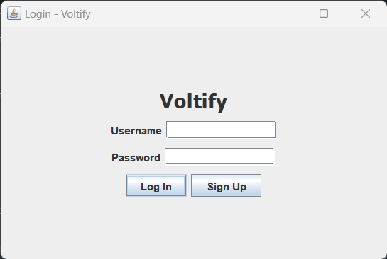
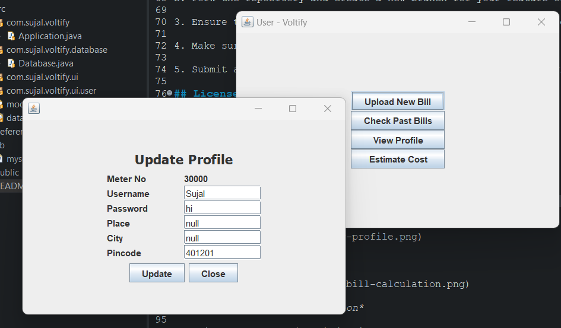
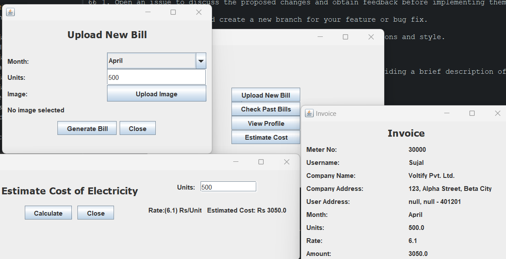
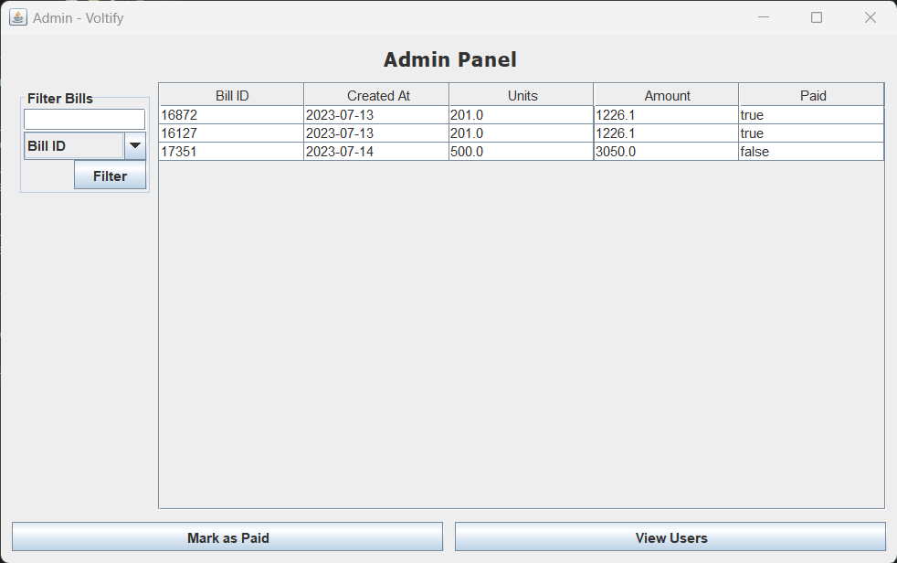

# Voltify - Electricity Billing System

Voltify is a Java-based electricity billing system that aims to automate the process of calculating electricity bills based on the units consumed. It provides a seamless and convenient solution for users and local electricity offices to efficiently manage billing and data sharing. With its robust features and emphasis on data accuracy and security, Voltify is a modern take on the classic electricity billing system.

## Features

- Accurate calculation of the bill amount based on the units consumed.
- Instantaneous sharing of data between local electricity offices and users.
- Ensured safety and prevention of tampering with data.

## Installation

To run the Voltify electricity billing system locally, follow these steps:

1. Clone the repository:

   ```bash
   git clone https://github.com/SujalChoudhari/Voltify.git
   ```

2. Import the project into your preferred Java IDE (e.g., Eclipse).

3. Configure the module dependencies:

   - Right-click on the project in the IDE.
   - Select "Build Path" -> "Configure Build Path".
   - In the "Libraries" tab, click on "Classpath" -> "Add JARs".
   - Navigate to the `/Voltify/lib/` directory and select `mysql-connector-j-8.0.33.jar`.
   - Click "Apply" and "OK" to save the changes.

4. Set up the database:

   - Execute the SQL query in `/Voltify/src/database.sql` to create the database and tables required for the application.
   - Update the connection details in the `Application` class to match your database configuration:

     ```java
     database = new Database("jdbc:mysql://localhost:3306/voltify", System.getenv("user"), System.getenv("pass"));
     ```

5. Build and run the application using your IDE's built-in tools.

## Usage

1. Run the `Application` class (Make sure the database services are active).

2. Use the provided login panel to authenticate as either a User or an Admin.

3. Users can sign up, view/update their profile, estimate the cost based on the rate of 6.1 rs/unit, view past bills, and pay new bills by uploading the meter reading photo for verification.

4. Admins can view bills, mark them as paid, and access user data.

## Database Configuration

Voltify utilizes a MySQL database for data storage. The connection details can be configured in the `Database` class. 
use the environment variables to use your own connection (`user`,`pass`).  
Also update the url `jdbc:mysql://localhost:3306/voltify` if needed.

Make sure you have MySQL installed and running on your local machine before running the Voltify application.
Open the `/Voltify/src/database.sql` and use its queries to create required tables and `admin`.
Default admin credentials are id=`0`,username=`admin`,password=`admin`.

## Contributing

Contributions to Voltify are welcome and appreciated. To contribute, please follow these guidelines:

1. Open an issue to discuss the proposed changes and obtain feedback before implementing them.

2. Fork the repository and create a new branch for your feature or bug fix.

3. Ensure that your code adheres to the project's coding conventions and style.

4. Make sure to test your changes thoroughly.

5. Submit a pull request, referencing the original issue and providing a brief description of your changes.

## License

Voltify is licensed under the [MIT License](LICENSE).

## Screenshots

Add relevant screenshots of the Voltify application here.



*Screenshot 1: Login Panel*



*Screenshot 2: User Profile*



*Screenshot 3: Bill Calculation*



*Screenshot 4: Admin Dashboard*